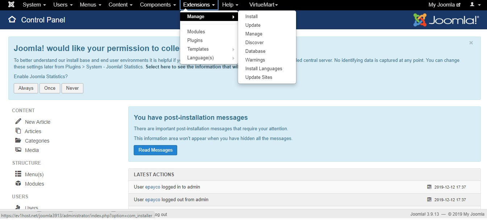
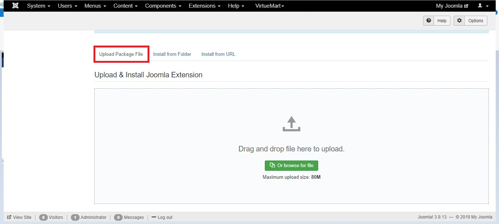
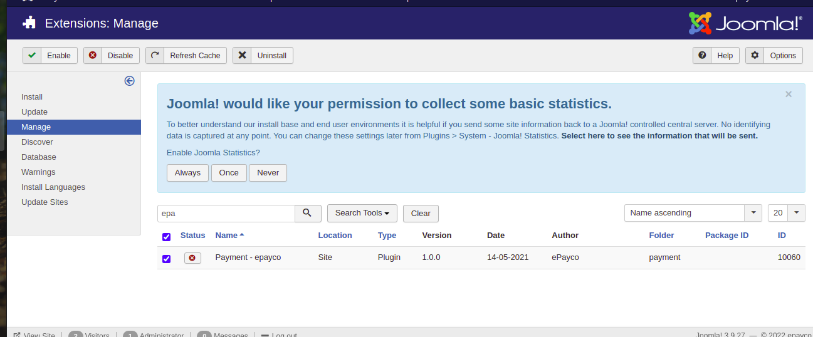
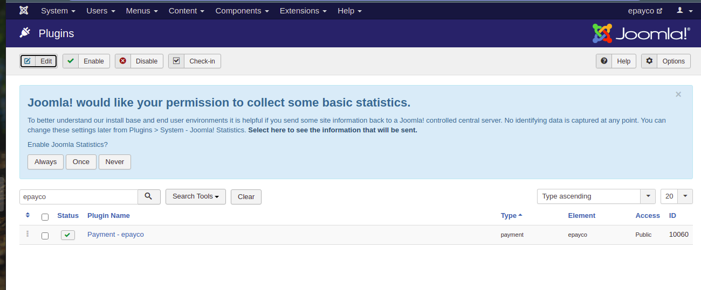

# plugin_ePayco_Quick2cart
plugin de ePayco para Quick2cart

**Si usted tiene alguna pregunta o problema, no dude en ponerse en contacto con nuestro soporte técnico: desarrollo@payco.co.**

## Tabla de contenido

* [Requisitos](#requisitos)
* [Instalación](#instalación)
* [Configuración](#configuración)
* [Pasos](#pasos)
* [Versiones](#versiones)

## Requisitos

* Tener una cuenta activa en [ePayco](https://epayco.com/).
* Tener instalado Joomla v3.9 y Quick2cart v3.0 o versiones superirores
* Acceso a las carpetas donde se encuetra instalado Joomla y Quick2cart.
* Acceso al admin de Joomla.

## Instalación

1. [Descarga el plugin.](https://github.com/epayco/plugin_ePayco_Quick2cart)
2. Diríjase a la sección **Extensions** en el menú principal y despliegue las opciones, haga click en la opcion **Extension Manager**.
3. En la sección **Upload Package File**, haga click en el botón **Seleccionar archivo**, y proceda a buscar y seleccionar el plugin de ePayco.
4. Luego de seleccionar el plugin, haga click sobre el botón **Upload & install**, Joomla le notificara cuando la instalación termine, luego diríjase a la sección **Manage**.
5. Encontrará un campo disponible para buscar, digite ePayco y presione el botón search, en la tabla se mostrar el plugin de ePayco con estado inactivo(círculo rojo), seleccione el plugin.
6. Oprima el botón verde con el texto **Enable** que se encuentra en la parte superior, para activar. Cuando el círculo rojo que se encuentra en el campo status en la tabla cambie a color verde, significa que el plugin está activo.
7. Diríjase a la sección **Extensions** en el menú principal y despliegue las opciones, haga click en la opcion **Plugins**. Encontrará un campo disponible para buscar, digite ePayco y presione el botón search, en la tabla se mostrar el plugin de ePayco con estado Activo, seleccione el plugin. 
8.  Oprima el botón con el texto **Edit** que se encuentra en la parte superior, para configurar los datos del plugin.

## Configuración

1. Configure los siguientes campos:

	* **P_CUST_ID_CLIENTE**: Numero de usuario.
	* **P_KEY**: Código asignado por ePayco.
	* **PUBLIC_KEY**: Numero de usuario.
	* **Modo de pruebas**: yes(para realizar pruebas) o no (pasar a producción).
	* **OnePage Checkout**: yes(Onpage Checkout) o no (Estandar checkout).
2. Presione el botón **Save & close** que se encuentra en la parte superior derecha para guardar la configuración.
## Pasos

## Versiones
* [ePayco plugin Quick2cart joomla v3.9.X, Quick2cart 3.0.x](https://github.com/epayco/plugin_ePayco_Quick2cart/releases/tag/v3.0).
